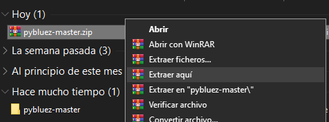
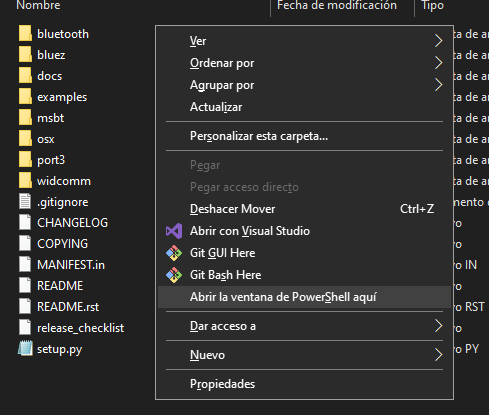
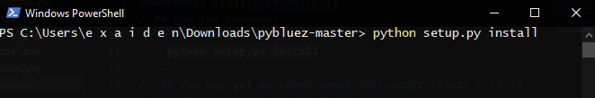
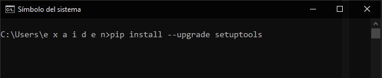

## Translated with google (sorry)

# In order to use the PyBluez library (Bluetooth) you have to do the following steps:
* ## go to [this link](https://github.com/karulis/pybluez) (and say thanks to the creator of the library)
* ## Download the master 
  

* ## Extract the .zip file, then go into the extracted folder 
  
* ## press (Shift + right click) on the folder and open the PowerShell 
   
* ## Run the command:
  ```cmd
    python setup.py install
  ```
      

*  ## You may get an error about *Microsoft Visual C ++ 14.0*. To fix it just do the following:
    *  ## Install [Build Tools](https://visualstudio.microsoft.com/en/visual-cpp-build-tools/).
    * ## Once the app is open, you must install what appears in the image: 
     and wait for it to finish installing the packages.
    * ## Once the installation is finished, you must run in CMD:
    ```cmd
    pip install --upgrade setuptools
    ```
    
    * ## And finally, go back to the master folder and use the command again
    ```cmd
        python setup.py install
    ```
* ## After all this, you should now be able to use the PyBluez library.
* ## If you have any questions, you can check the PyBluez repository, where there is a lot of information about it.